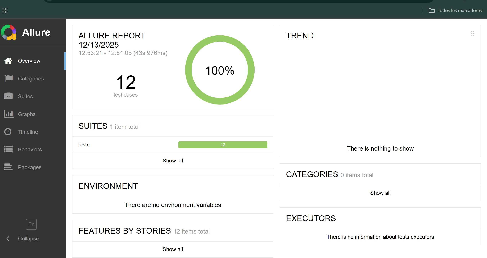
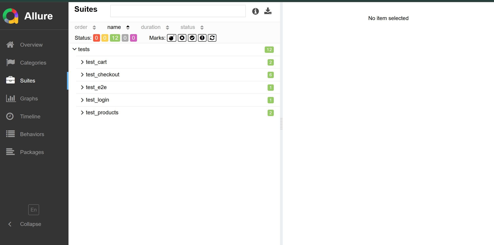
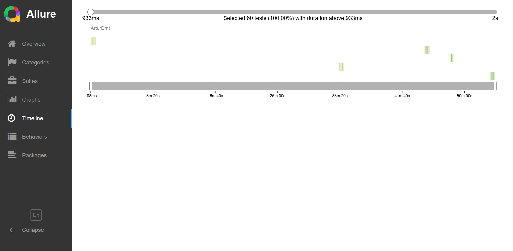
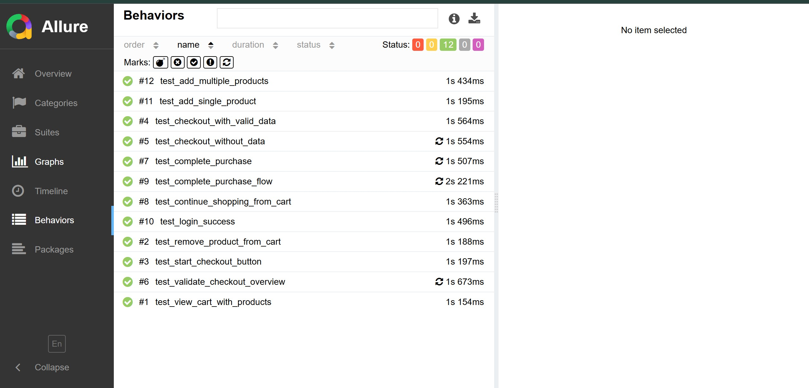

#  QA Framework - SauceDemo

[](https://www.python.org/)
[](https://playwright.dev/)
[](https://pytest.org/)
[]()

> Professional test automation framework using Python, Playwright and Page Object Model for E2E testing of SauceDemo.

---

##  Features

-  **Page Object Model (POM)** - Scalable and maintainable architecture
-  **Pytest Markers** - Smoke, Regression, E2E tests organized
-  **Screenshots on Failure** - Automatic error capture
-  **Allure Reports** - Professional dashboards with graphs
-  **12 Test Cases** - Complete coverage of critical functionalities
-  **CI/CD Ready** - Prepared for continuous integration

---

##  Tech Stack

- Python 3.11+
- Playwright 1.57.0
- Pytest 9.0.2
- Allure 2.36.0

---

##  Project Structure
`
QA_Framework_SauceDemo/
 pages/              # Page Object Models
 tests/              # Test suites
 core/               # Core utilities
 reports/            # Allure reports
 screenshots/        # Failure screenshots
 conftest.py
 pytest.ini
 requirements.txt
`

---

##  Installation
`ash
# Clone repository
git clone https://github.com/YOUR-USERNAME/QA_Framework_SauceDemo.git
cd QA_Framework_SauceDemo

# Create virtual environment
python -m venv venv
.env\Scriptsctivate  # Windows

# Install dependencies
pip install -r requirements.txt
playwright install chromium
`

---

##  Usage
`ash
# Run all tests
pytest -v

# Run smoke tests
pytest -m smoke -v

# Run with Allure report
pytest --alluredir=reports/allure-results
allure serve reports/allure-results
`

---

##  Test Cases (12 total - 100% passing)

- **Login:** Valid credentials
- **Products:** Add single/multiple products
- **Cart:** View items, remove products
- **Checkout:** Complete flow with validations
- **E2E:** Full purchase journey

---

##  Reports

Allure reports include:
- Dashboard with metrics
- Execution timeline
- Success rate graphs
- Test case details
- Failure screenshots

---

##  Author

**Artur Dmytriyev**
- LinkedIn: www.linkedin.com/in/arturdmytriyev
- GitHub: https://github.com/arturdmt-alt 

---

 If you found this project helpful, give it a star on GitHub!


## 📊 Test Reports

This framework generates professional Allure reports with detailed test execution analytics.

### Latest Test Results
- ✅ **12/12 tests passing** (100% success rate)
- ⏱️ **Execution time:** ~43 seconds
- 📅 **Last run:** December 13, 2025

### Sample Reports

#### Overview Dashboard

*12 automated tests with 100% pass rate*

#### Test Suites

*Complete test coverage across all features*

#### Timeline

*Fast and efficient test execution*

#### Test Behaviors

*Detailed view of all 12 test cases*

### Generate Reports Locally
```bash
# Run tests with Allure
pytest --alluredir=reports/allure-results

# View report
allure serve reports/allure-results
```
